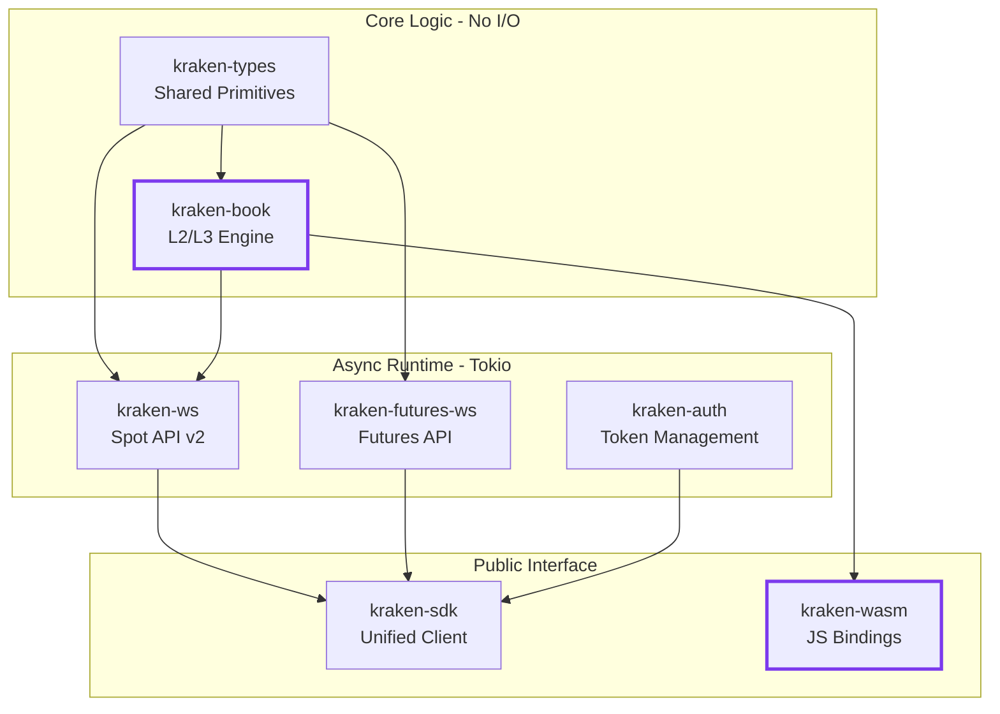
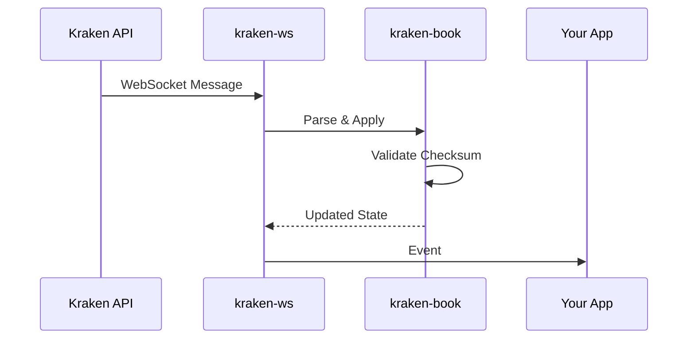
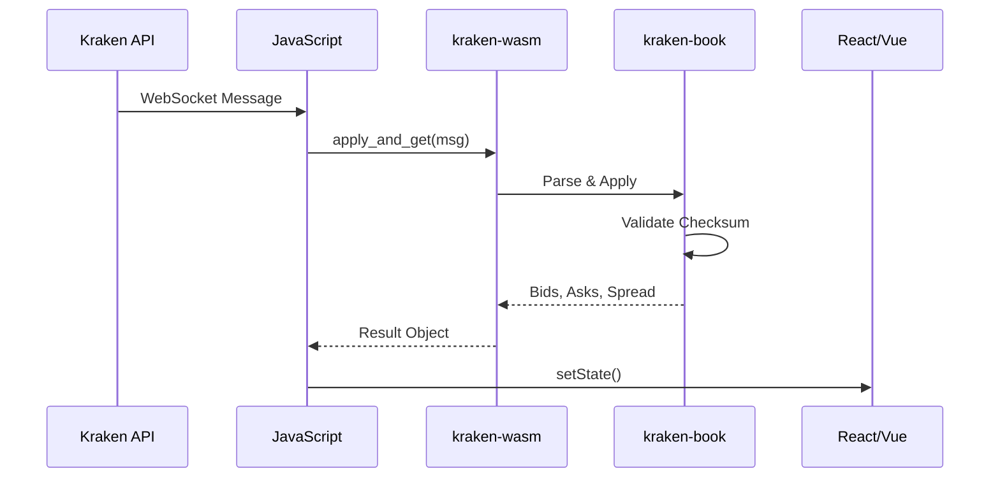

## Design Philosophy

Havklo is built on one core principle: **separate computation from I/O**.

The orderbook engine (`kraken-book`) contains zero networking code and no async runtime dependencies. This enables:

- **Native performance** with Tokio in backend systems
- **Browser execution** when compiled to WebAssembly
- **Deterministic testing** without network mocking
- **Runtime portability** across different async executors

## Crate Hierarchy



## Crate Overview

| Crate | Purpose | WASM | Deps |
|-------|---------|------|------|
| `kraken-sdk` | Unified high-level API | No | 268 |
| `kraken-ws` | Spot WebSocket v2 + trading | No | ~100 |
| `kraken-futures-ws` | Futures perpetuals streaming | No | ~100 |
| `kraken-auth` | API authentication, token refresh | No | ~50 |
| `kraken-book` | L2/L3 orderbook engine | **Yes** | 35 |
| `kraken-types` | Core types, enums, errors | **Yes** | 28 |
| `kraken-wasm` | JavaScript/TypeScript bindings | **Yes** | 35 |

<Note>
For browser/WASM usage, only `kraken-book` (35 deps) is needed. The full SDK includes the async runtime, networking, and observability.
</Note>

## Data Flow

<Tabs>
  <Tab title="Native (Rust)">

  </Tab>
  <Tab title="Browser (WASM)">

  </Tab>
</Tabs>

## Why This Matters

<CardGroup cols={2}>
  <Card title="Same Logic Everywhere" icon="equals">
    CRC32 validation, decimal precision, and state management work identically native and in-browser.
  </Card>
  <Card title="Test Once, Run Anywhere" icon="check-double">
    Unit tests run synchronously against kraken-book without mocking network calls.
  </Card>
  <Card title="Minimal Browser Bundle" icon="minimize">
    Only 35 dependencies compile to WASM. No async runtime bloat.
  </Card>
  <Card title="Incremental Adoption" icon="stairs">
    Use just kraken-types for definitions, or the full SDK for a complete solution.
  </Card>
</CardGroup>

## Dependency Strategy

```
kraken-types (28 deps)
└── serde, rust_decimal, thiserror
    └── Minimal, serialization-focused

kraken-book (35 deps)
└── kraken-types + BTreeMap, VecDeque
    └── Pure computation, no I/O

kraken-sdk (268 deps)
└── tokio, tungstenite, dashmap, tracing...
    └── Full async networking stack
```

<Tip>
When building a WASM app, JavaScript handles the WebSocket. The WASM module only runs orderbook logic - no networking compiled into the binary.
</Tip>
