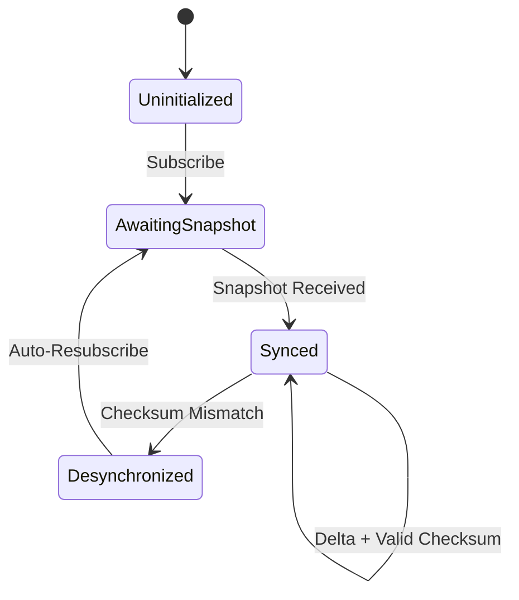

## What is an Orderbook?

An orderbook is a real-time record of all open buy and sell orders for a trading pair. It's the core data structure for understanding market liquidity and price discovery.

```
        BIDS (Buy Orders)              ASKS (Sell Orders)
        -----------------              -----------------
        Price      Qty                 Price      Qty
        67,432.50  2.5    <-- Spread -->  67,433.00  1.8
        67,432.00  1.2                    67,433.50  3.1
        67,431.50  4.8                    67,434.00  0.5
```

## L2 vs L3

<Tabs>
  <Tab title="L2 (Aggregated)">
**Level 2** aggregates all orders at each price into a single quantity.

```rust
// L2 Level
pub struct Level {
    pub price: Decimal,  // 67,432.50
    pub qty: Decimal,    // 2.5 (total at this price)
}
```

**Best for:**
- Market dashboards
- Spread monitoring
- Liquidity analysis
- Most trading applications
  </Tab>
  <Tab title="L3 (Order-Level)">
**Level 3** shows individual orders with their IDs.

```rust
// L3 shows each order separately
Bids at 67,432.50:
├── order_abc: 1.0 BTC (position 1)
├── order_def: 0.8 BTC (position 2)
└── order_ghi: 0.7 BTC (position 3)
    Total: 2.5 BTC
```

**Best for:**
- Queue position tracking
- Fill probability estimation
- Order flow analysis
- Market making strategies

<Warning>
L3 data requires special approval from Kraken and uses a separate endpoint.
</Warning>
  </Tab>
</Tabs>

## State Machine

Havklo maintains orderbook state through a deterministic state machine:



| State | Meaning |
|-------|---------|
| `Uninitialized` | No subscription active |
| `AwaitingSnapshot` | Subscribed, waiting for initial data |
| `Synced` | Receiving and applying delta updates |
| `Desynchronized` | Checksum failed, resyncing automatically |

## Checksum Validation

Kraken includes a CRC32 checksum with every orderbook message. Havklo validates on every update:

```rust
// Checksum is computed over top 10 bid/ask levels
// Format: ask0_price + ask0_qty + ask1_price + ... + bid0_price + bid0_qty + ...
let checksum = crc32(concatenated_levels);
```

If mismatch detected:
1. Orderbook marked `Desynchronized`
2. Auto-unsubscribe from channel
3. Auto-resubscribe for fresh snapshot
4. `ChecksumMismatch` event emitted for logging

<Tip>
You never handle checksum validation manually. Havklo does this transparently on every update.
</Tip>

## Depth Levels

Configure how many price levels to track:

```rust
pub enum Depth {
    D10 = 10,     // Top 10 (fastest, least data)
    D25 = 25,     // Top 25
    D100 = 100,   // Top 100
    D500 = 500,   // Top 500
    D1000 = 1000, // Full depth (most data)
}
```

```rust
let client = KrakenClient::builder(symbols)
    .with_depth(Depth::D25)  // 25 levels per side
    .connect()
    .await?;
```

<Note>
More depth = more data = more processing. For most apps, `D10` or `D25` is sufficient.
</Note>

## Key Metrics

| Method | Returns | Performance |
|--------|---------|-------------|
| `best_bid()` | Highest buy price | 1 ns |
| `best_ask()` | Lowest sell price | 1 ns |
| `spread()` | `ask - bid` | 3.5 ns |
| `mid_price()` | `(bid + ask) / 2` | 22.7 ns |

```rust
if let Some(spread) = client.spread("BTC/USD") {
    println!("Spread: {} USD", spread);
}
```

All values are `Decimal` for precision - no floating-point errors.
