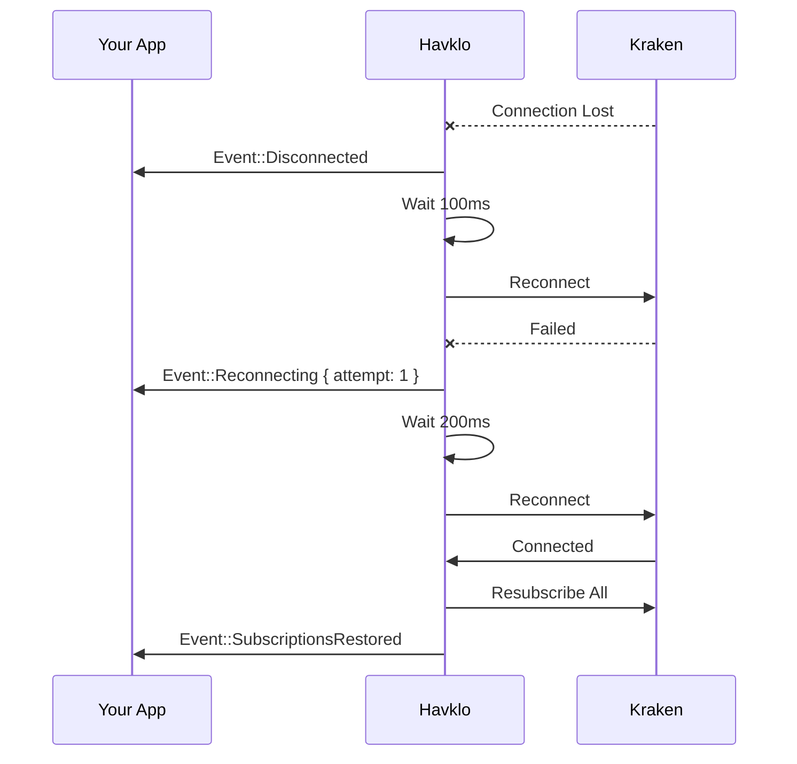
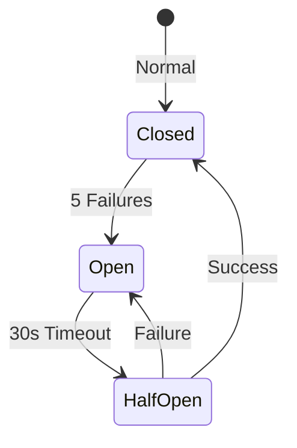

## Automatic Reconnection

Network connections fail. Havklo handles this automatically with exponential backoff:



## Configuration

```rust
use kraken_sdk::ReconnectConfig;
use std::time::Duration;

let client = KrakenClient::builder(symbols)
    .with_reconnect(ReconnectConfig {
        initial_delay: Duration::from_millis(100),
        max_delay: Duration::from_secs(30),
        multiplier: 2.0,
        max_attempts: Some(10),  // or None for unlimited
    })
    .connect()
    .await?;
```

| Parameter | Default | Description |
|-----------|---------|-------------|
| `initial_delay` | 100ms | First retry delay |
| `max_delay` | 30s | Maximum delay cap |
| `multiplier` | 2.0 | Exponential factor |
| `max_attempts` | None | Unlimited by default |

**Backoff sequence:** 100ms -> 200ms -> 400ms -> 800ms -> ... -> 30s (capped)

## Circuit Breaker

Prevents hammering the API during extended outages:



```rust
use kraken_sdk::CircuitBreakerConfig;

let client = KrakenClient::builder(symbols)
    .with_circuit_breaker(CircuitBreakerConfig {
        failure_threshold: 5,
        reset_timeout: Duration::from_secs(30),
        half_open_timeout: Duration::from_secs(60),
    })
    .connect()
    .await?;
```

## Handling Events

```rust
match event {
    Event::Connection(ConnectionEvent::Disconnected { reason }) => {
        log::warn!("Lost connection: {:?}", reason);
    }
    Event::Connection(ConnectionEvent::Reconnecting { attempt, delay }) => {
        log::info!("Reconnecting (attempt {}, waiting {:?})", attempt, delay);
    }
    Event::Connection(ConnectionEvent::SubscriptionsRestored { count }) => {
        log::info!("Back online with {} subscriptions", count);
        // Safe to resume normal processing
    }
    Event::Connection(ConnectionEvent::CircuitBreakerOpen { trips }) => {
        log::error!("Circuit breaker open after {} trips", trips);
    }
    _ => {}
}
```

<Tip>
Treat `SubscriptionsRestored` as your "all clear" signal. Don't use stale data from before the disconnect.
</Tip>

## Disable Reconnection

For testing or single-shot connections:

```rust
let client = KrakenClient::builder(symbols)
    .without_reconnect()
    .connect()
    .await?;
```
